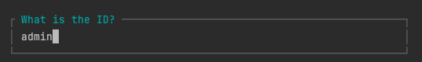
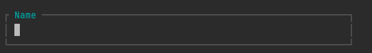
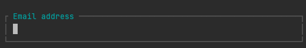
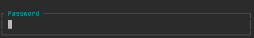
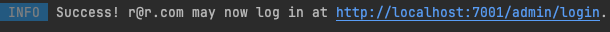

# Manage Students Application

## Overview

The Manage Students Application is a Laravel-based project designed to manage students, courses, and advisors with an admin interface powered by Filament. It supports CRUD operations, media uploads, and role-based authentication.

## Features

- Student Management: Add, edit, delete, and view student records.

- Course Management: Manage courses and associate them with students and advisors.

- Advisor Management: Manage advisors and their relationships with students and courses.

- Media Uploads: Upload and display profile photos for students using Spatie Media Library.

- Admin Panel: Filament-based admin panel for managing all resources.

## Prerequisites

- PHP >= 8.1

- Composer

- Docker & Docker Compose (for containerized development)

- MySQL

## Installation

1. Clone the Repository

- git clone https://github.com/rdbindia/manage-students.git
- cd manage-students

2. Install Dependencies

- composer install

3. Set Up Environment Variables

- Copy the .env.example file to .env:

- cp .env.example .env

- Update the .env file with your database and application settings:

```
APP_NAME=ManageStudents
APP_URL=http://localhost:7001
DB_CONNECTION=mysql
DB_HOST=database
DB_PORT=3306
DB_DATABASE=manage_students
DB_USERNAME=root
DB_PASSWORD=yourpassword
```

4. Set Up the Database

``` 
make migrate 
make seed
```

5. Set Up Storage

Create the symbolic link for public storage:

`php artisan storage:link`

6. Start Docker 

If using Docker:

`docker-compose up -d` (for first time setup use --build)

7. Run the Development Server

Run `make createuser`

- Add AdminPanelProvider


- Add a User's name here

- Add a user email address

- Add a password


* Success! 



```
Admin Panel Access

Seeded Admin User:

Email: admin@example.com

Password: password
```

Visit the Filament admin panel at:

http://localhost:7001/admin

## To access Frontend
- You can check the list of students using the link 

http://localhost:7001/students

## Testing

- Run tests using:

`php artisan test`


