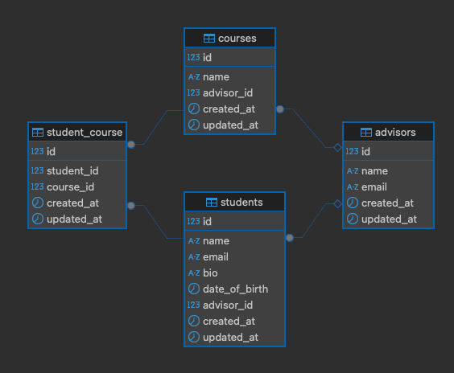

# Software Design Document (SDD)

### Project Name: Manage Students System

## Introduction

### Purpose

The purpose of this system is to manage students, advisors, and courses efficiently. The system allows administrators to
perform CRUD operations on students, advisors, and courses using the Filament Admin Panel. Additionally, it integrates
relationships between students and advisors, and students and courses, enabling comprehensive academic management.

### Scope

- CRUD operations for students, advisors, and courses.
- Relation managers on Student and Advisor resource.
- Admin panel using [Filament](https://filamentphp.com/docs)
- Display Student List on frontend using TALL stack

## Architecture Overview

### System Architecture

- **Backend**: PHP with Laravel 10.x
- **Frontend**: Filament Admin Panel (Livewire-based)
- **Database**: MySQL
- **Containerization**: Docker
- **File Storage**: Local disk/ [Spatie Media Library](https://filamentphp.com/plugins/filament-spatie-media-library)

## Data Design

### Database Tables

#### 1. Students Table:

- Stores student data and has an advisor id.
- Has one-to-one relation with Advisor.

#### 2. Advisors Table:

- Stores Advisor data.
- An Advisor has many Students.

#### 3. Courses Table:

- Stores Course data to the DB table and has an advisor id.
- Has one-to-one relation with Advisor.

#### Student_Course Table (Pivot):

- Stores the student_id and course_id relationship
- Has a many-many relationship with Students and Courses
- A Student can enroll in many Courses.
- A Course can have many Students.

## Functional Design

### Features

#### Student Management

- Create, read, update, and delete student records.
- Assign an advisor to a student.
- Upload and manage profile photos.

#### Advisor Management

- Manage advisor records (CRUD operations).

#### Course Management

- Manage course records (CRUD operations).
- Associate students with multiple courses dynamically.

## Testing Design

- Simulate CRUD operations via Filament:
- Create, update, and delete students.
- Test advisor assignment and course enrollment.

## Future Enhancements

- Add more tests.
- Add profile page for frontend student view
